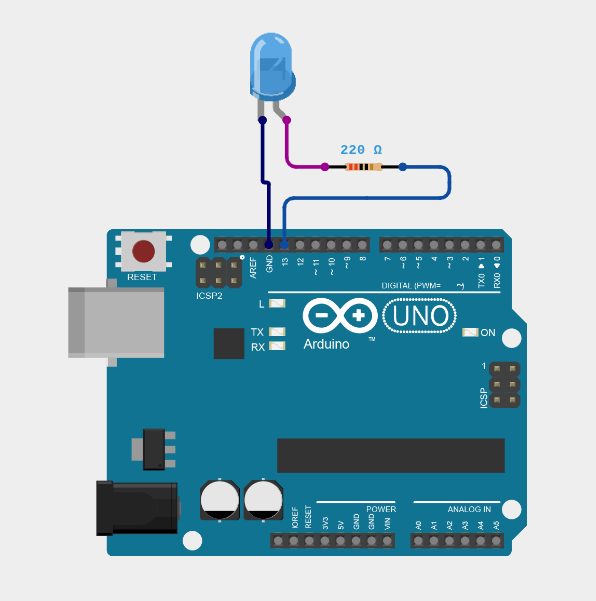

# LED Blink Using Arduino

## Objective

To learn how to control an LED using an Arduino Uno and understand the basic concept of digital output.

---

## Description

In this activity, an LED is connected to an Arduino Uno through a resistor. A simple Arduino program is used to turn the LED ON and OFF repeatedly.

This is one of the simplest Arduino activities and helps students understand how a microcontroller can control an electronic component.

---

## Components Required

- Arduino Uno
- LED
- 220Ω resistor
- Breadboard
- Jumper wires
- USB cable
- Laptop

For the complete component details, see [components.md](components.md).

---

## Software Required

- Arduino IDE
- Arduino Uno board package
- USB driver, if required by the computer

---

## Theory

### What is an LED?

LED stands for **Light Emitting Diode**. It is an electronic component that produces light when electric current flows through it in the correct direction.

An LED has two terminals:

- **Anode (+)** – positive terminal
- **Cathode (-)** – negative terminal

The longer leg of a standard LED is usually the anode, while the shorter leg is usually the cathode.

### What is Arduino?

Arduino is a microcontroller-based development platform used to build and control electronic projects.

The Arduino Uno can read inputs from sensors or switches and control outputs such as LEDs, motors and buzzers.

### What is Digital Output?

A digital output has two basic states:

- HIGH → ON
- LOW → OFF

In this activity, the Arduino sets a digital pin to HIGH to turn the LED ON and LOW to turn it OFF.

### Why is a Resistor Used?

A resistor is connected in series with the LED to limit the current flowing through it.

Without a suitable current-limiting resistor, too much current could flow through the LED and damage it.

### How Does the Activity Work?

The Arduino program first configures the selected digital pin as an output.

The program then follows these steps:

1. Set the digital pin HIGH.
2. The LED turns ON.
3. Wait for a fixed time.
4. Set the digital pin LOW.
5. The LED turns OFF.
6. Wait again.
7. Repeat the process continuously.

This produces a blinking LED.

---

## Circuit Diagram

